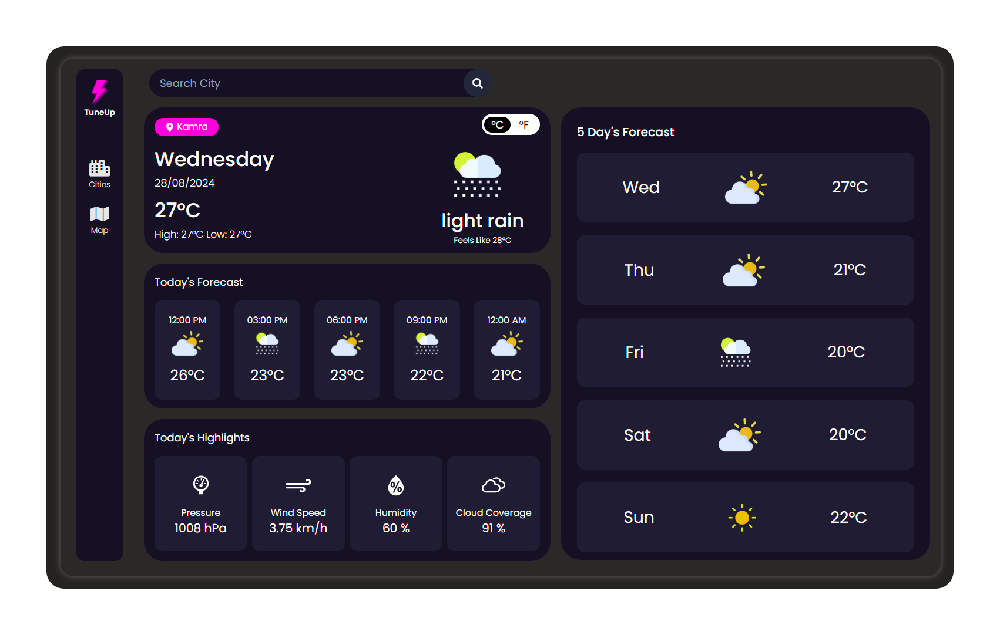
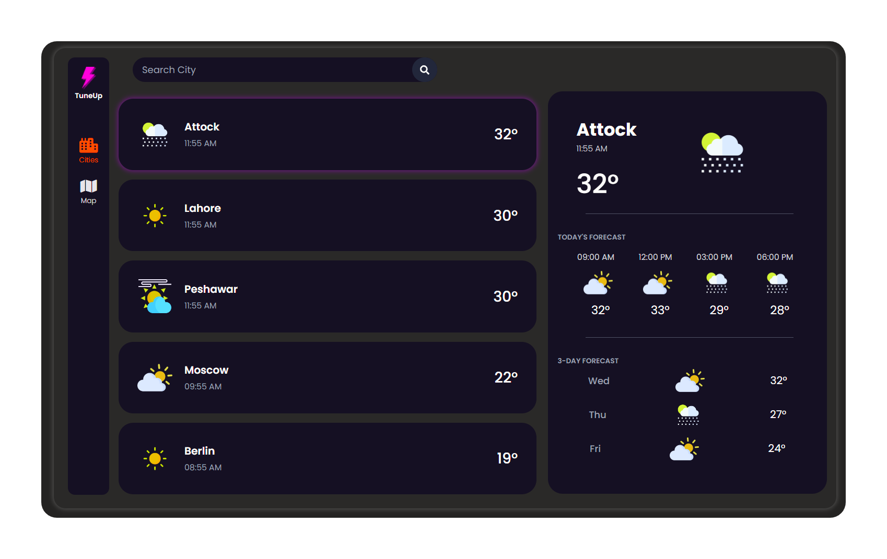
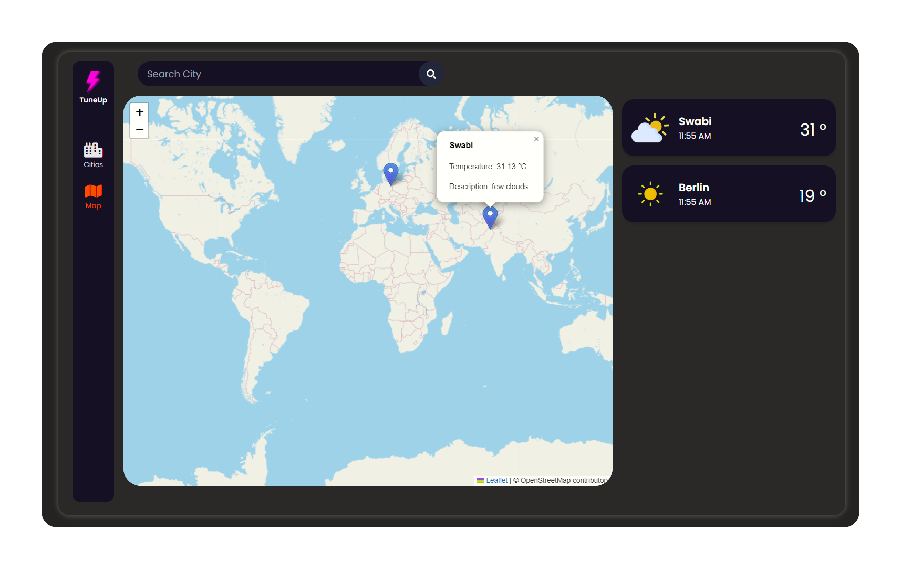

# 🌦️ Weather Application

Welcome to the Weather Application! This app provides real-time weather updates, forecasts, and highlights for cities around the world. Built with React, Tailwind CSS, and Leaflet for mapping, this app is your go-to for all weather information. 

## 🚀 Features

- **Real-time Weather Updates:** Get current weather data including temperature, humidity, wind speed, and more.
- **Forecasts:** View hourly and weekly forecasts with intuitive icons for different weather conditions.
- **Interactive Map:** Search for cities and view their weather on an interactive map.
- **Today’s Highlights:** Detailed highlights of the day’s weather metrics.
- **Global Coverage:** Check weather for popular cities worldwide.

## 🛠️ Tech Stack

- **Frontend:** 
- **Styling:**  
- **APIs:**     
- **Mapping:**  
- **Routing:**  

## 📸 Screenshots





## 📜 How to Run the Project

1. **Clone the repository:**
    ```bash
    git clone https://github.com/yourusername/weather-app.git
    ```
2. **Install dependencies:**
    ```bash
    npm install
    ```
3. **Run the application:**
    ```bash
    npm start
    ```

## 🤝 Contributing

Contributions are welcome! Feel free to submit a pull request.

## 📧 Contact

For any inquiries, please contact: [sarcasticsahal@gmail.com](mailto:sarcasticsahal@gmail.com)

---

**Enjoying the app? Give it a ⭐️ on GitHub!**

